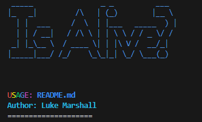

# IsAlive?  
   

### Project Description  
IsAlive is my first attempt to create a network management automation script with Python. This is not intended to be used in production environments, and is purely for experimental purposes, as I wanted to try a full-scale network management automation script using Python. I am still relatively new to Python, so I would love for constructive criticiscm regarding my code, the way I have written it, the logic I implemented or if there are better approaches/methods to some of the objectives that I intend to meet with this script.  

## How to use  
**This script also only works with devices using Cisco IOS. Future project plans may include expanding the capabilites of the script which use other networking OS's.**  

1. After cloning the repository, run the pip3 command and pass the `-r` flag to read the contents of the req file:  
`pip3 install -r requirements.txt`  

4. Once pip has installed all the requirements listed in `requirements` text file, Run the script using:  

`python3 isalive.py`  

## Script Usage:  
IsAlive runs through an inventory concept - You create an inventory with networking device names and their corresponding management IPs. Once you create an inventory with your desired networking devices, You can perform tasks, such as checking if all the devices are up (through the script pinging each management IP provided), running a health check on a device, check all and/or a specific interface status, check OSPF/BGP configuration/routing tables and check the CDP neighbours of a specific device.  

Once an inventory is created, it will be accessible each time you run the script. This is achieved by creating a text file with a dictionary containing information about your inventory, and the script will read it each time it is run. This text file is encrypted to prevent storing sensitive credentials locally, and is stored as `.invlist.txt`.  
The initial script menu will present two options:  
`1. Load Inventory. 2. Create New Inventory (Choose 1 or 2/ q to quit)`  

If it is your first time running the script, choose option 2 to create a new inventory, or option 1, which will detect that you have no inventories created and will prompt you to create a new one. Creating a new inventory will require the following information:  
**The username needed to log into these devices**  
**The password for this account**  
**The amount of devices you would like to the inventory**  
**The name and management IP of each device**  

As mentioned before, all of this information is stored locally in your cloned repository folder, under `.invlist.txt`. Clearing the contents of this file will remove all inventories to be used by the script, and deleting it will trigger the script to create a new `.invlist.txt` file once it is run again. Once you created your new inventory, or choose option 1 of the menu, the script will first check the status of all devices in the inv (either UP or DOWN, with rate of packet loss based on the scripts ping to the management IP of the device). If a device is found to be DOWN (4-1 packets lost from the 4 ICMP ping requests), you will be prompted with the following:  

`To see traceroute output of a device which is down, type the name of the device OR press q to do other tasks`  

If you would like to see the traceroute output of a device which the script captured as down, enter the specific device name. This will display the contents of the traceroute, which was captured by the script and held in a text file during the initial test. The script aims to use as little extra files as possible so entering `q` to do other tasks, will remove this text file, and can only be regenerated by running Option 1 from the menu again. If you wish to do other tasks, you will be presented with the following options:  

`1. Run Health Check on a Device`  
`2. Check all interface statuses`  
`3. Check a specific interface status`  
`4. Check CDP neighbours on a device`  
`5. Check OSPF configuration on a device`  
`6. Check BGP configuration on a device`  

Running a health check on a device consists of obtaining information from specific Cisco IOS commands, to generate a simple overview of the device health. Information includes the device's uptime, CPU usage by processes, CPU history graph, and amount of memory used on the device. All of this information is gathered by running the appropiate command on the device, retrieving and displaying it to the end user.  

Enter the menu option number to run the appropiate task. For each option, you will be prompted to enter the device name of the device you would like to run the task on, and from there, the script will output the terminal output from the appropiate command issued. **This script communicates with each networking device via SSH, and achieves this using the netmiko Python library**. All of the information gather during the creation of an inventory is used to establish an SSH connection to the device, and logs in with the username/password you provided upon creation. The script then runs the appropiate command on the device for the chosen menu option, and then captures the terminal output and displays it to the user. To see the commands run, you can view the source code, and navigate to the `device_tasks` class, where each function sends a command to the device.  

Pressing `q` from the option prompt will return the user to the main menu, and you can repeat the following steps to load/create new inventories.  

## Future ideas:  
1. Implement a CSV upload function, where users provide the path for a CSV file containing device names/IPs, which is then read and an inventory is created from it.  
2. ~~Encrypt the stored `.invlist.txt` file, to ensure non-encrypted files containing usernames/passwords are not stored locally on the users system.~~ ADDED: 15/04/2024.  
3. Expand script capability - more options for things to do on each networking device.  

## Personal Notes:  
I think this script grew way larger than it should have been - note to self in future to find ways to write cleaner, simpler code *lol*  

I would love to hear ideas for things to implement in the script!

